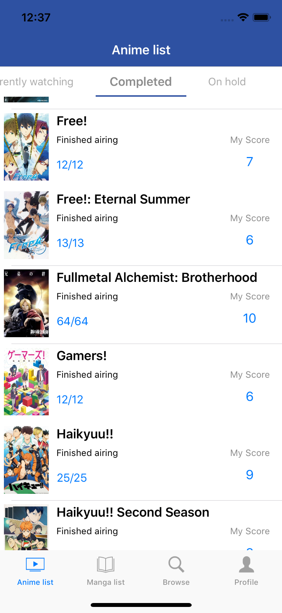
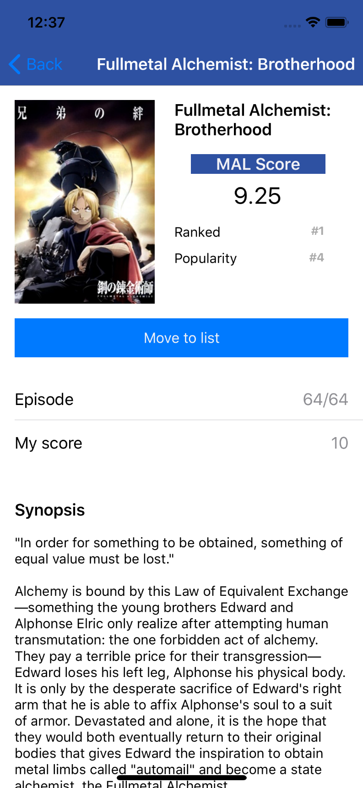
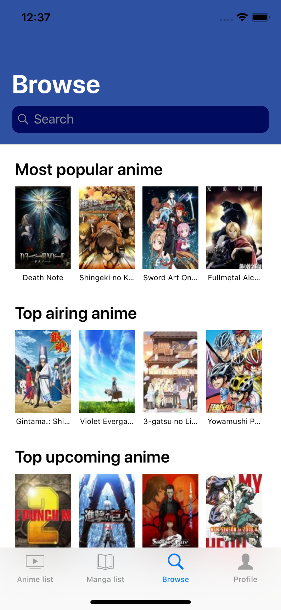
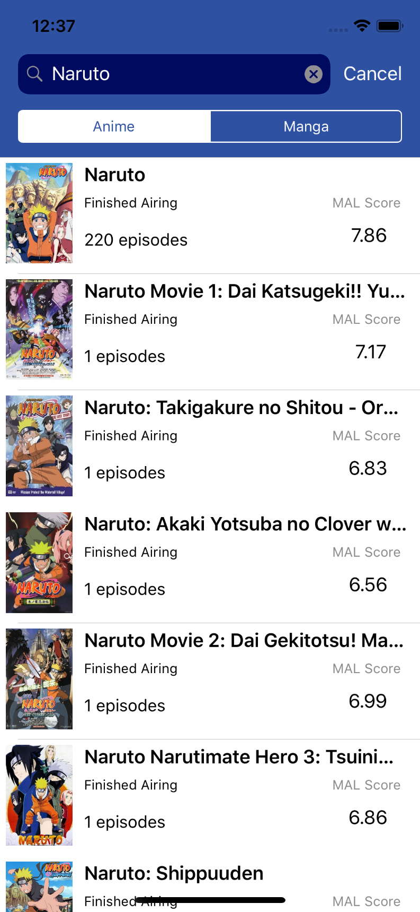

# Miru

iOS Unofficial MyAnimeList mobile app.

Note: MyAnimeList API is experiencing security vulnerabilities, leading to the outages of all applications utilising this API until further notice.

## Features
* Viewing own anime/manga lists
* Adding anime/manga to list
* Deleting anime/manga from list
* Rating anime/manga
* Changing episodes/chapters
* Browsing myanimelist for anime and manga
* View own profile page

## Screenshots

    
    
    
    
    

